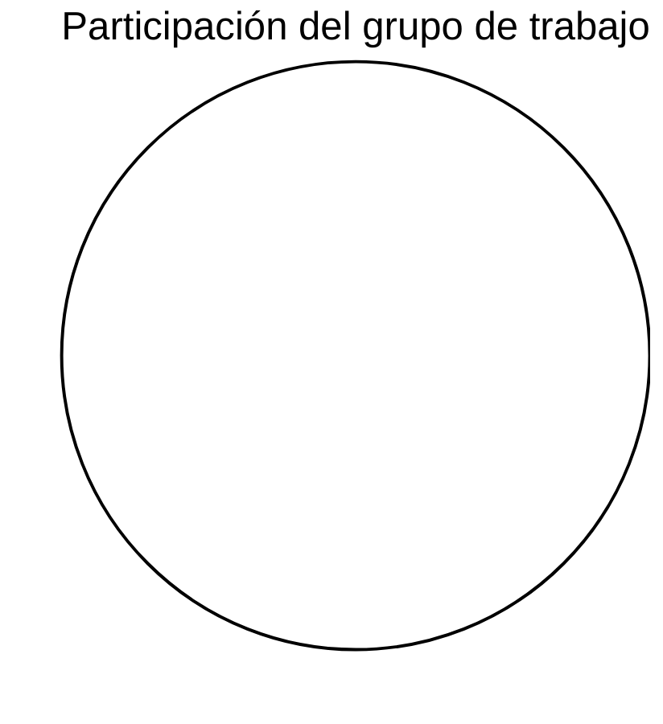

# FarmaExpres

Proyecto principal del ecosistema FarmaExpres.


## Tabla de Contenido

- [Descripción](#descripcion)
- [La Empresa](#empresa)
- [Problemática](#problematica)
- [Objetivo General](#objetivo-general)
- [Objetivos Específicos](#objetivos-especificos)
- [Funcionamiento de la Plataforma](#funcionamiento)
- [Alcance del Sistema](#alcance)
- [Beneficios del Sistema](#beneficios)
- [Valor para el Negocio](#valor-negocio)
- [Arquitectura General](#arquitectura-general)
- [Contexto Frontend](#contexto-frontend)
- [Estructura del Ecosistema](#estructura-del-ecosistema)
- [Stack Tecnológico](#stack-tecnologico)
- [Requisitos del Entorno](#requisitos-del-entorno)
- [Equipo](#equipo)
- [Estado del Proyecto](#estado-del-proyecto)
- [KPI de participación del grupo de trabajo](#kpi-de-participacion-del-grupo-de-trabajo)

---

<a id="descripcion"></a>

## Descripción

FarmaExpres es una plataforma orientada a la gestión y operación de servicios farmacéuticos.

El sistema está diseñado bajo una arquitectura modular basada en microservicios, separando responsabilidades entre frontend, backend, API, base de datos y documentación arquitectónica. Esta estructura permite:

- Escalabilidad horizontal  
- Mantenimiento independiente por módulo  
- Despliegue desacoplado  
- Trabajo colaborativo estructurado  

Este repositorio funciona como **hub principal**, centralizando y organizando el ecosistema completo del proyecto.

---

<a id="empresa"></a>

## La Empresa

FarmaExpres representa el modelo de una pequeña farmacia que opera desde una única sede y requiere mejorar la forma en que administra sus medicamentos, inventario y procesos internos.

Actualmente muchas farmacias pequeñas gestionan su inventario mediante registros manuales o herramientas básicas, lo que dificulta el control adecuado de los productos, sus fechas de vencimiento y los movimientos de inventario.

FarmaExpres busca resolver esta situación mediante una plataforma digital que permita organizar y controlar la información de manera centralizada, confiable y accesible para los usuarios autorizados.

---

<a id="problematica"></a>

## Problemática

Las farmacias pequeñas enfrentan diversas dificultades en la gestión de sus medicamentos y operaciones internas, entre ellas:

- Falta de control claro sobre el inventario disponible.
- Riesgo de vender medicamentos vencidos.
- Pérdidas económicas por productos que caducan sin ser detectados a tiempo.
- Registros manuales que generan errores humanos.
- Dificultad para conocer el historial de movimientos de los productos.
- Falta de información confiable para la toma de decisiones administrativas.

---

<a id="objetivo-general"></a>

## Objetivo General

Desarrollar una plataforma digital que permita gestionar y controlar el inventario de medicamentos de una farmacia con una única sede, facilitando el registro de productos, movimientos de inventario y consultas en tiempo real.

---

<a id="objetivos-especificos"></a>

## Objetivos Específicos

- Implementar un sistema para registrar medicamentos con lote, fecha de vencimiento y cantidad disponible.
- Permitir el control de entradas y salidas de medicamentos.
- Registrar el historial de movimientos del inventario.
- Implementar control de usuarios y permisos.
- Generar alertas de medicamentos próximos a vencer.
- Facilitar consultas rápidas del inventario.

---

<a id="funcionamiento"></a>

## Funcionamiento de la Plataforma

FarmaExpres funcionará como una aplicación web donde los usuarios autorizados podrán acceder mediante un sistema de inicio de sesión.

Una vez dentro del sistema podrán:

- Registrar medicamentos.
- Consultar el inventario disponible.
- Registrar entradas de productos.
- Registrar salidas de medicamentos.
- Visualizar alertas de vencimiento.
- Consultar el historial de movimientos.

Toda la información se almacenará en una base de datos que permitirá mantener un control organizado y confiable de los medicamentos.

---

<a id="alcance"></a>

## Alcance del Sistema

La plataforma FarmaExpres está diseñada para apoyar la gestión operativa de una farmacia con una única sede.

El sistema permitirá:

- Gestión de usuarios
- Registro de medicamentos
- Control de inventario
- Registro de entradas y salidas
- Control de fechas de vencimiento
- Consulta de historial de movimientos
- Alertas de medicamentos próximos a vencer

Inicialmente no se contemplan integraciones externas con sistemas contables o de facturación.

---

<a id="beneficios"></a>

## Beneficios del Sistema

- Mayor control del inventario.
- Reducción de errores humanos.
- Prevención de pérdidas por medicamentos vencidos.
- Información organizada y disponible en tiempo real.
- Mejor toma de decisiones administrativas.
- Seguridad en el acceso a la información.

---


<a id="valor-negocio"></a>

## Valor para el Negocio

FarmaExpres aporta valor al negocio al proporcionar una herramienta tecnológica que facilita el control del inventario y la organización de los procesos internos de la farmacia.

La plataforma permitirá reducir errores operativos, mejorar la gestión de medicamentos y contar con información confiable para la toma de decisiones administrativas.

---

<a id="arquitectura-general"></a>

## Arquitectura General

FarmaExpres está dividido por responsabilidades:

- **Portal (Frontend)** → Interfaz de usuario  
- **Backend (Microservicios)** → Lógica de negocio  
- **API** → Exposición y orquestación de endpoints  
- **Database** → Persistencia y administración de datos  
- **Diagramas** → Modelado estructural y comportamental del sistema  
- **Documentación** → Requerimientos, MoSCoW, MVP, trazabilidad y avances  

---

<a id="contexto-frontend"></a>

## Contexto Frontend

El frontend de FarmaExpres corresponde al **portal web** del sistema y está orientado a una arquitectura modular por dominio, con separación de responsabilidades entre vistas, componentes y servicios.

### Propósito funcional

El frontend está diseñado para cubrir la interacción de usuarios con los procesos clave del negocio:

- Gestión de usuarios y permisos.
- Gestión de medicamentos.
- Control de inventario.
- Registro y consulta de movimientos.
- Visualización de alertas, reportes y auditoría.

### Estructura técnica del frontend

Organización principal dentro del portal:

```bash
frontend/src/
├── layout/
├── medicines/
├── users/
└── shared/
```

Cada módulo se organiza bajo una estructura tipo:

```bash
<module>/
├── pages/
├── components/
└── services/
```

### Visión de implementación frontend

La implementación final del portal se plantea con una experiencia modular, orientada por roles y centrada en procesos operativos de farmacia.

El frontend deberá:

- Integrar autenticación y navegación por permisos.
- Unificar la experiencia de gestión de usuarios, medicamentos e inventario.
- Soportar trazabilidad operativa mediante movimientos, reportes y auditoría.
- Presentar indicadores y alertas para apoyar decisiones en tiempo real.
- Mantener coherencia visual y funcional entre todos los módulos del sistema.

### Referencias externas frontend

- Demo visual del portal: [FarmaExpres Demo](https://temenico.my.canva.site/farmaexpres)

---


<a id="estructura-del-ecosistema"></a>

## Estructura del Ecosistema

El proyecto FarmaExpres está organizado en varios repositorios que separan las responsabilidades del sistema.

### Frontend (Portal)
Interfaz de usuario de la aplicación.

🔗 [FarmaExpres Frontend](https://github.com/Temenico/FarmaExpres-Frontend)

---

### Backend (Microservicios)
Implementación de la lógica de negocio y servicios principales del sistema.

🔗 [FarmaExpres Backend](https://github.com/jose6668/FarmaExpres_Backend)

- Microservicios principales:
    - 🔗 [FarmaExpres Micro Gateway](https://github.com/jose6668/FarmaExpres_Micro_Gateway.git)
    - 🔗 [FarmaExpres Micro Inventory](https://github.com/jose6668/FarmaExpres_Micro_Inventory.git)
    - 🔗 [FarmaExpres Micro Login](https://github.com/jose6668/FarmaExpres_Micro_Login.git)

    Breves descripciones:

    - **FarmaExpres Micro Gateway:** puerta de enlace y orquestador entre el frontend y los microservicios; maneja enrutamiento, balanceo ligero, y políticas de autenticación.
    - **FarmaExpres Micro Inventory:** servicio encargado de la gestión de inventario, incluyendo productos, lotes, existencias y movimientos (entradas/salidas).
    - **FarmaExpres Micro Login:** servicio de autenticación y autorización; gestión de usuarios, sesiones y emisión/validación de tokens.

---

### API
Gestión y exposición de los endpoints que conectan el frontend con los microservicios.

🔗 [FarmaExpres API](https://github.com/Marlon271/FarmaExpres-api)

---

### Base de Datos
Estructura y configuración de las bases de datos utilizadas en el sistema.

   - 🔗 [FarmaExpres Database](https://github.com/Marlon271/FarmaExpres-database)
     
   - 🔗 [FarmaExpres Database_NoSQL](https://github.com/Marlon271/FarmaExpres-Micro-NoSQL#)

---

### Documentación
Documentos técnicos del proyecto como requerimientos, MoSCoW, MVP y análisis del sistema.

🔗 [FarmaExpres Documentation](https://github.com/jose6668/FarmaExpres-Doc)

---

### Diagramas
Diagramas UML, BPMN y modelos arquitectónicos del sistema.

🔗 [FarmaExpres Diagramas](https://github.com/jose6668/FarmaExpres-Diagramas)

---

### Seguimiento y Avances (Weeks)
Registro del progreso del proyecto por semanas.

🔗 [FarmaExpres Weeks](https://github.com/jose6668/FarmaExpres-Weeks)

---

<a id="stack-tecnologico"></a>

## Stack Tecnológico

### Frontend
- React  
- Vite  
- JavaScript (ES Modules)  
- Axios  
- Tailwind CSS  
- Docker + Nginx  

### Backend
- Java  
- Maven  
- Arquitectura basada en microservicios  
- API REST  

### Base de Datos
- PostgreSQL  
- MongoDB  

### Control de Versiones
- Git  
- GitHub  

### Herramientas
- IntelliJ IDEA  
- Visual Studio Code  

---

<a id="requisitos-del-entorno"></a>

## Requisitos del Entorno

- JDK 17 o superior  
- Maven  
- PostgreSQL  
- MongoDB  
- Git  

---

<a id="equipo"></a>

## Equipo

Proyecto desarrollado por estudiantes del programa de Ingeniería de Sistemas — CORHUILA.

- **Buitrago Murcia Jersson Fabián**
- **Romero Trujillo Marlon David**
- **Tello Méndez Nicolás**
- **Vargas Herrera José Leonardo**

---

<a id="estado-del-proyecto"></a>

## Estado del Proyecto

En desarrollo activo.

Actualmente se encuentra en fase de:

- Consolidación de arquitectura modular
- Implementación progresiva de microservicios
- Documentación formal (RF, RNF, MoSCoW, MVP)
- Diseño de diagramas UML
- Seguimiento por semanas

El proyecto evoluciona bajo un enfoque incremental.

<a id="kpi-de-participacion-del-grupo-de-trabajo)"></a>

<!-- KPI:START -->
## KPI de participación del grupo de trabajo

**Fórmula:**  
Participación (%) = (commits únicos del integrante / commits únicos totales del ecosistema) × 100

**Última actualización:** 2026-09-07 00:11 UTC

**Cobertura del KPI:** todos los commits detectados en todas las ramas de todos los repositorios configurados, deduplicados por SHA.

### Tabla consolidada

| Integrante | Commits únicos | Participación | Repos | Ramas |
|---|---:|---:|---:|---:|

### Gráfico de torta



### Gráfico de barras

```mermaid
xychart-beta
    title "Participación del grupo de trabajo"
    x-axis []
    y-axis "Commits únicos" 0 --> 1
    bar []
```
<!-- KPI:END -->
